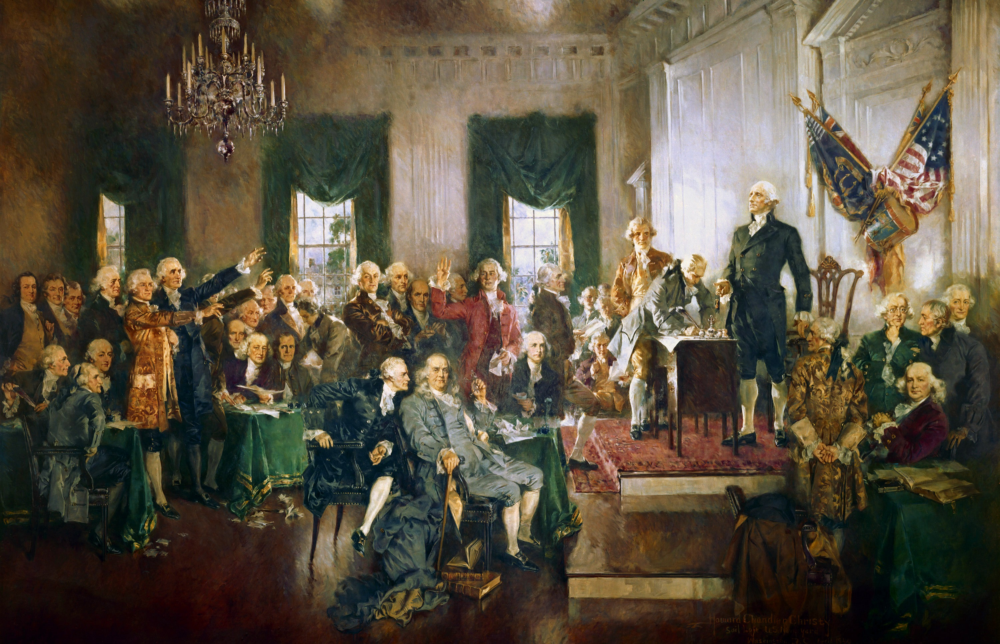
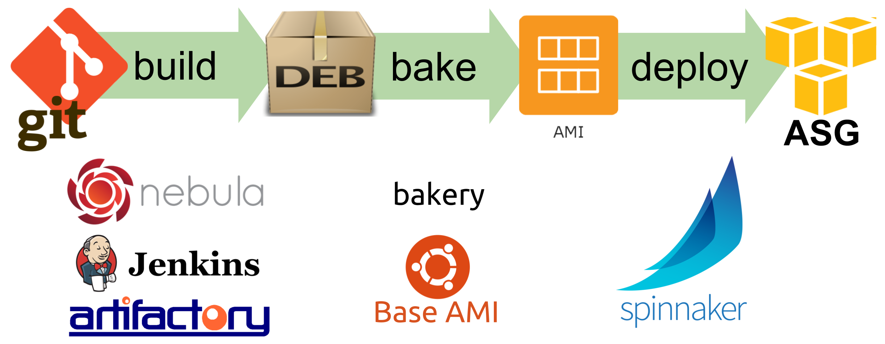
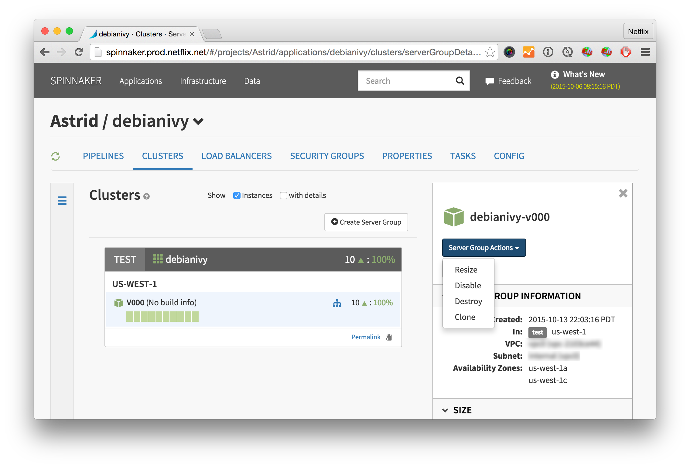
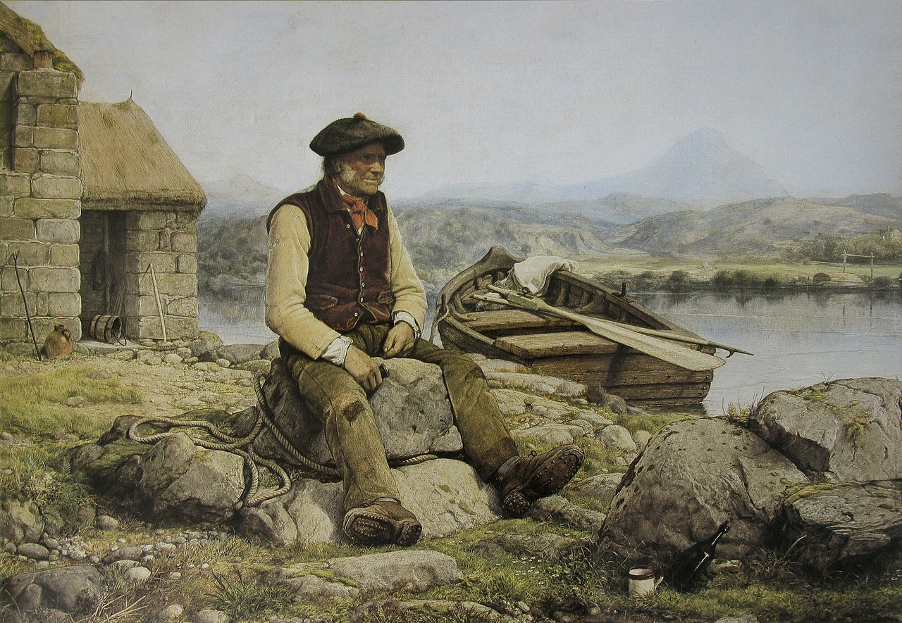
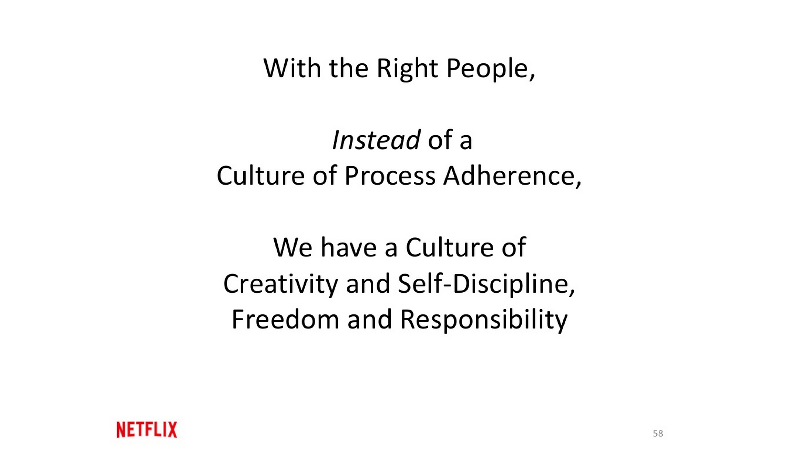
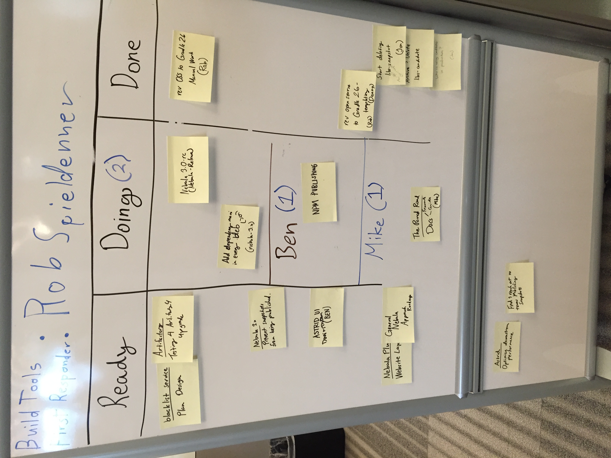
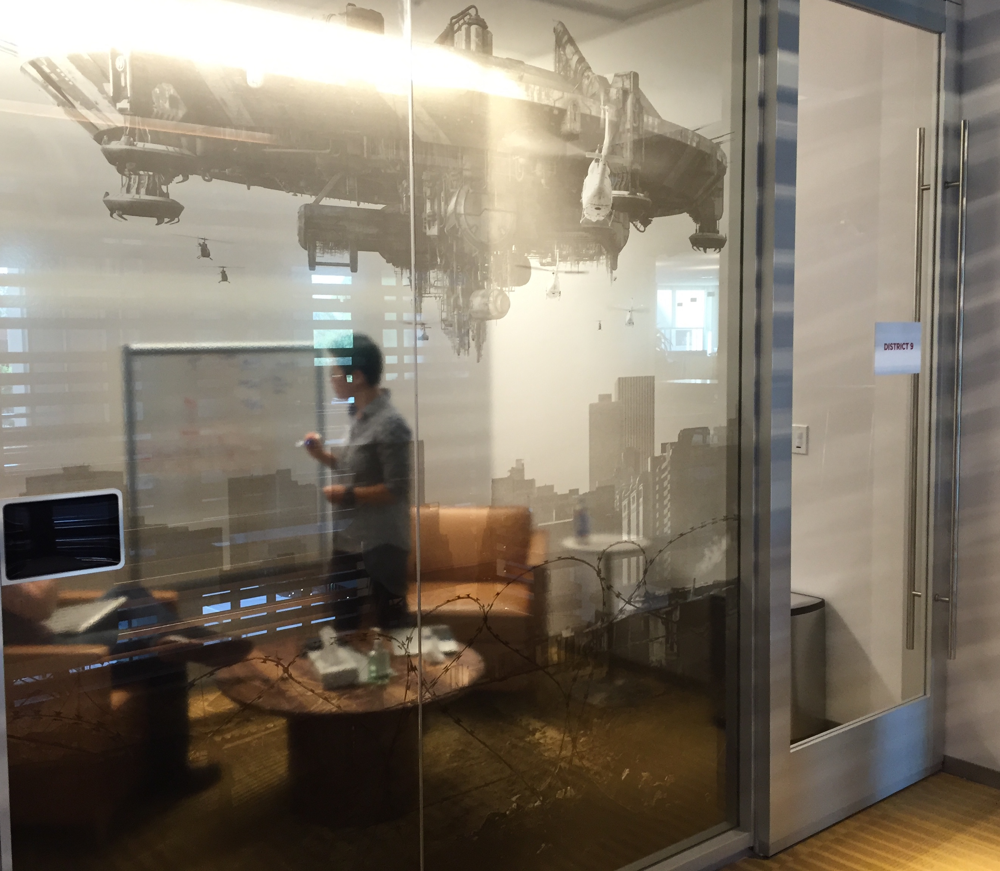
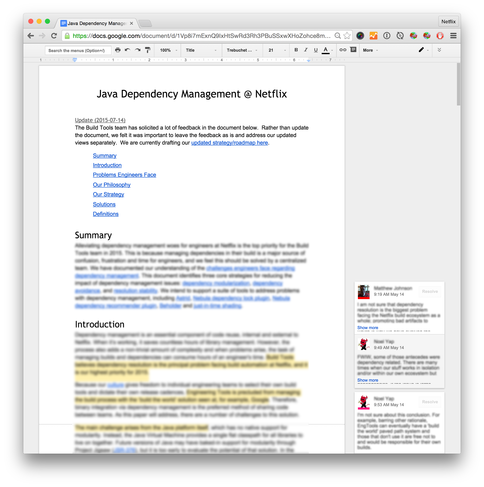
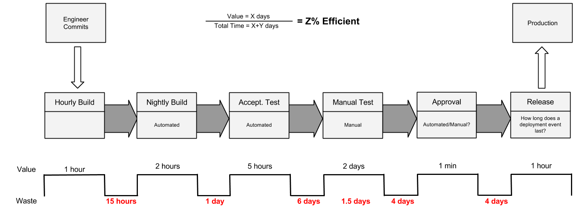

footer: © J. Michael McGarr, 2016
slidenumbers: false

# [fit] Beyond the culture deck:
###  _**What you don't already**_
###  _**know about Netflix**_

#### Mike McGarr   **_[@SonOfGarr](http://twitter.com/SonOfGarr)_**   _**[MikeMcGarr.com](http://www.mikemcgarr.com)**_

---
### two years ago...

---
## Director of DevOps 

^
- led the tools team
- migrate to continuous delivery
- introduce lean & kanban
- refine test automation

---

^ 
- got the opportunity of a lifetime
- joined the Netflix EngTools team 

---
## What makes Netflix 
## so special?

^ 
- wanted to understand how they work
- contribute to the famous culture
- what can I learn about high performing cultures
- can't share everything

---
# [fit] Beyond the culture deck:
###  _**What you don't already**_
###  _**know about Netflix**_

#### Mike McGarr   **_[@SonOfGarr](http://twitter.com/SonOfGarr)_**   _**[MikeMcGarr.com](http://www.mikemcgarr.com)**_

---
### what you can learn from Netflix

^ - avoid cargo culting
- share what is actionable
- questions to ask of your own culture

---

^ let's start with the Culture deck

---  
> It may well be the most important document ever to come out of the Valley.[^1]
-- Sheryl Sandberg

[^1]: [GQ Magazine, 2013](http://www.gq.com/story/netflix-founder-reed-hastings-house-of-cards-arrested-development)

---
### Our Constitution

^ - we constantly refer to it
- there are sometimes differing interpretations
- cultural self-awareness

---
### Freedom AND 
### Responsibility

^ - most notable and attractive portion of our culture

---
### Freedom

^ - people love freedom

---
### Responsibility

^ - don't forget the AND

---
## You _**build**_ it
## You _**own**_ it

---

# Engineering Tools

^ 
- let's look at an example
- this also applies to engtools

---

^ 
- self-service
- we build it, we own it
- Our Paved Road

---
If you want more _**freedom**_, 
you must take on more _**responsibility**_.

---
### Do those with 
## the _**responsibility**_, 
### also have 
## the _**freedom**_?

---
alignment?

^ - with so much freedom, who ensures alignment?

---
### Context, 
### not Control

^ - manage through context
- provide employees the right context 
- high trust culture

---
Managers focus on the _**'what'**_
Engineers focus on the _**'how'**_

^ - I am responsible for priorities & strategy
- engineers are responsible for design/impl
- freedom is not total

---

# Cloud deployment lessons

- immutable server pattern
- register with Eureka
- red black deployments
- rule of 3

---

## [fit] how do we ensure _**compliance**_?

---

we don't

^ - Don't prevent mistakes
- Do provide them all the info they need to make the right decision

---
### Make doing the right thing easy

^ - EngTools Paved Road
- strong focus on UX for internal tools

---

## provide fast feedback

^ - Conformity Monkey

---
### If you give your employees the
### [fit] _**right business context**_
### can you trust them to make the 
### [fit] _**right decisions**_?

^ - Not just a Netflix thing
- Damon Edwards and the show Carrier

---
### Centralized teams

^ - an outcome of F&R are product teams

---

^ - deploying software is like crossing a river

---

^ - highly coupled
- somebody else's responsibility

---

### centralized _**Ops or QA**_ teams

^ - a likely outcome
- QA is responsible for testing
- Ops is responsible for operations

---

^ - the Netflix DevOps model is like a bridge
- centralized teams provide the bridge
- dev teams drive themselves across the river

---

### centralized _**Tools**_ teams

^ teams take ownership of deployment

---
Centralized teams _**enable**_ product teams

^ the key word here is enable

---
_**Engineering**_ Tools
_**Security**_ Engineering
_**Performance**_ Engineering
_**Traffic and Chaos**_ Engineering
_**Insight**_ Engineering 
_**Platform**_ Engineering

---
### _**No**_ ops team
### _**No**_ QA team

---
### How coupled are your 
### [fit] _**centralized teams**_ 
### to your 
### [fit] _**product teams**_?

---
### process

---

---
Netflix has no _**process**_?

---
Immune system against _**unnecessary**_ process

---
process allergy

---
### our process

---
# [fit] Use Process to solve problems
### [fit] _**(Then aggressively abandon it wherever you can)**_

---
### Communication

---
### feedback

^ - candor
- fast feedback
- VP story

---
## Collaborative culture
### *(No brilliant jerks)*

---
### Strong opinions, *weakly held*

^ - the most effective people
- debate is common

---
## One on Ones

^ - 

---
### Memos

---
### When was the last time a
### [fit] _**high performer**_
### was let go for being 
### [fit] _**a jerk**_?

^ everybody knows at least one

---
### Waste

^ other forms of waste that might be familiar

---
## Eliminate waste

---
# Waste

- duplicate efforts
- throwaway code
- system rewrites

---
### Engineering Tools
### vs.
### Edge Developer Experience

---
### [fit] _**waste**_
### is a necessary byproduct of 
### [fit] _**innovation**_

---
### [fit] _**How tolerant**_ 
### is your culture of 
### [fit] _**duplicate or throwaway**_
### efforts?

---
### Takeaways

---
### Those with _**responsibility**_ 
### should have the _**freedom**_

---
### [fit] High performers will do the _**right thing**_, 
### given the _**right context**_

---
### Centralized teams 
### _**enable**_
### product teams

---
### Use _**process**_ to solve problems, 
### then abandon it

---
### _**high performing teams**_ 
### over 
### _**high performing jerks**_

---
### Innovation generates _**waste**_

---
# Questions?

### _**Mike McGarr**_ 
### [@SonOfGarr](http://twitter.com/SonOfGarr)
### [MikeMcGarr.com](http://www.mikemcgarr.com)