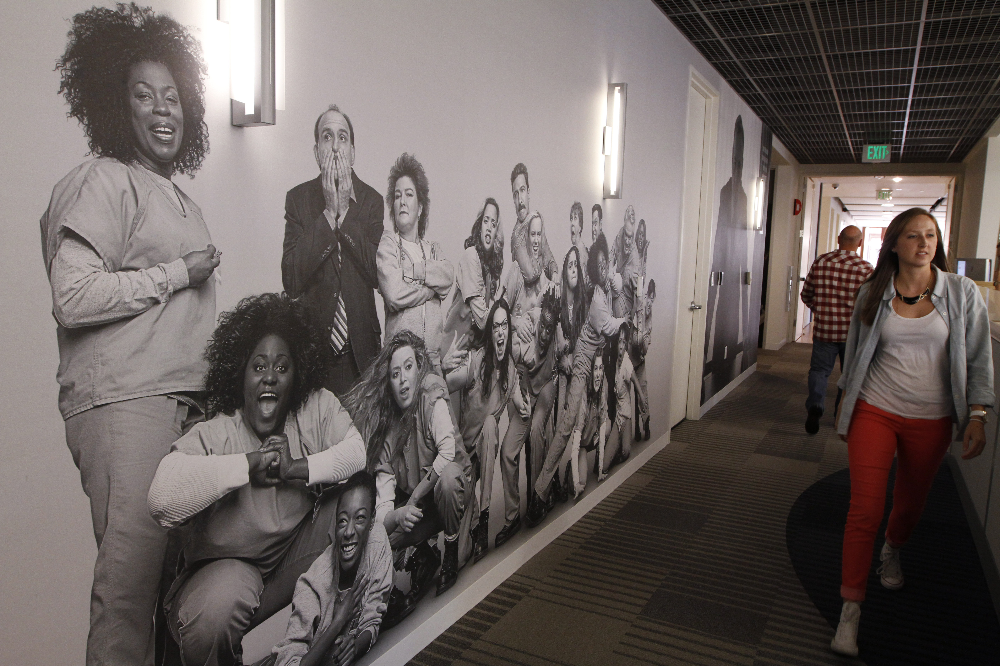

footer: © J. Michael McGarr, 2015
slidenumbers: false

# [fit] Beyond the culture deck:
###  _**What you don't already**_
###  _**know about Netflix**_

#### Mike McGarr   **_[@SonOfGarr](http://twitter.com/SonOfGarr)_**   _**[MikeMcGarr.com](http://www.mikemcgarr.com)**_

---
### a year and a half ago...

---
## Director of DevOps 

^
- led the tools team
- migrate to continuous delivery
- introduce lean & kanban
- refine test automation

---

^ 
- got the opportunity of a lifetime
- joined the Netflix EngTools team 

---
## What makes Netflix 
## so special?

---
### what enterprises can learn from Netflix

---

^ we are in the entertainment industry
we don't have the same restrictions

---

^ let's start with the Culture deck

---  
> It may well be the most important document ever to come out of the Valley.[^1]
-- Sheryl Sandberg

[^1]: [GQ Magazine, 2013](http://www.gq.com/story/netflix-founder-reed-hastings-house-of-cards-arrested-development)

---
### Our Constitution

^ - we constantly refer to it
- there are sometimes differing interpretations

---
### Freedom AND 
### Responsibility

---
### Freedom

---
### Responsibility

---
## You _**build**_ it
## You _**own**_ it

---

# _**F&R**_ 
## not just  
## for Engineers

^ Not just engineers -- everybody
Story: NEC -- head of legal

---
## "you _**can't**_ do that"
#### (something you rarely hear at Netflix)

---

# Engineering Tools

^ this also applies to engtools
we want to move fast too

---

^ we build self-service

---
If you want more _**freedom**_, 
you must take on more _**responsibility**_.

---
### _**Question:**_
### Do those with 
## the _**responsibility**_, 
### also have 
## the _**freedom**_?

---
alignment?

---
### Context, 
### not Control

^ manage through context
provide employees right context 

---
Managers focus on the _**'what'**_
Engineers focus on the _**'how'**_

---

# Cloud Deployments should...

- immutable server pattern
- register with Eureka
- red black deployments
- rule of 3

^ *Don't* prevent mistakes
^ *Do* provide them all the info they need to make the right decision

---

## [fit] how do we ensure _**compliance**_?

---

we don't

---
### Make doing the right thing easy

^ EngTools Paved Road

---

## provide fast feedback

^ Conformity Monkey

---
### _**Question:**_
### If you give your employees the
### [fit] _**right business context**_
### can you trust them to make the 
### [fit] _**right decisions**_?

---
### Centralized teams

^ an outcome of F&R are product teams

---

^ deploying software is like crossing a river

---

^ highly coupled

---

### centralized _**Ops or QA**_ teams

---

---

### centralized _**Tools**_ teams

---
Centralized teams _**enable**_ product teams

---
### _**No**_ ops team
### _**No**_ QA team

---
- we don't own your _**code**_
- we don't own your _**builds**_
- we don't own your _**pipelines**_
- we don't own your _**instances**_

---
### _**Question:**_
### How coupled are your 
### [fit] _**centralized teams**_ 
### to your 
### [fit] _**product teams**_?

---
### process

---

---
Netflix has no _**process**_?

---
Immune system against unnecessary process

---
process allergy

---
# [fit] Use Process to solve problems
### [fit] _**(Then aggressively abandon it wherever you can)**_

---
### Communication

---
### feedback

---
## Collaborative culture
### *(No brilliant jerks)*

^ Strong opinions, weakly held

---
## One on Ones

---
## Memos

^ share business context
communicate complex ideas
greatly benefits introverts and internal processors

---
### Team Meetings

^ share context

---
### Waste

---

## Eliminate waste

---
### [fit] _**waste**_
### is a necessary byproduct of 
### [fit] _**innovation**_

---
### _**Question:**_
### [fit] _**How tolerant**_ 
### is your culture of 
### [fit] _**duplicate or throwaway**_
### efforts?

---
### Wrapping it up

---
# Takeaways
1. Those with *responsibility* should have the *freedom*
2. High performers do the *right thing*, given the *right context*
3. Centralized teams *enable* product teams
4. Use *process* to solve problems, then abandon it
5. Innovation generates *waste*

---
## What I would love to hear

- stories of *bottom-up change*
- perspectives on *culture* (and sub-cultures)
- users of *Netflix OSS*

---
Questions?

---
### _**Mike McGarr**_   [@SonOfGarr](http://twitter.com/SonOfGarr)   [MikeMcGarr.com](http://www.mikemcgarr.com)