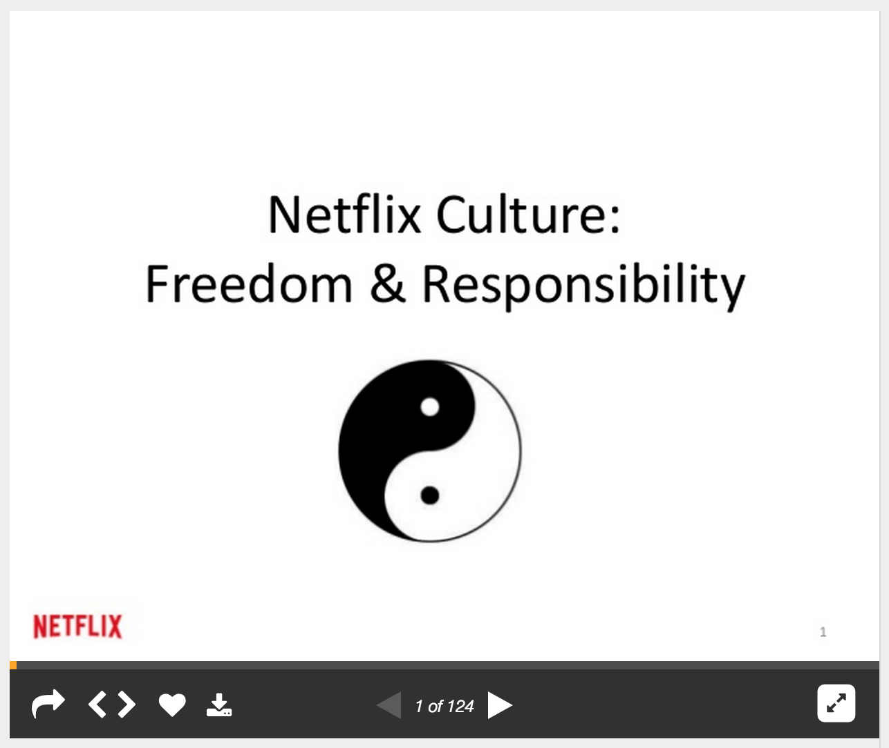

# Beyond the culture deck:
## *what you don't already know about Netflix*

---

# Netflix

---

^ mention it's importance to Silicon Valley
^ 

---

# our *Constitution*

---

# [fit] Freedom
# [fit] *and Responsibility*

---

# What this means
### Those *responsible*, have the *freedom*
### Your *freedom* is not my *responsibility*

---

# The Paved Road
### *First-class tooling for pushing code to prod*

---

# Freedom is not *total*

---

# No *Ops* teams
### Engineers operate their code in prod

---

# [fit] *Context*
# [fit] not Control

---

# Managers define the *what*
# Engineers define the *how*

^ context = business goals, strategy, vision, priorities
^ engineers focus on design

---

# "you *can't* do that"
### (you rarely hear this at Netflix)

---

# "here's why that's not a good idea"
### (you hear this a lot)

---

---

## *Don't* prevent somebody from making a mistake
## *Do* provide them all the info they need to make the right decision
